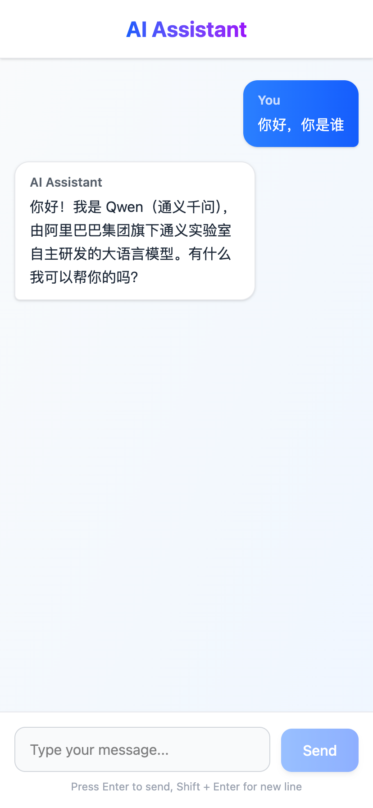
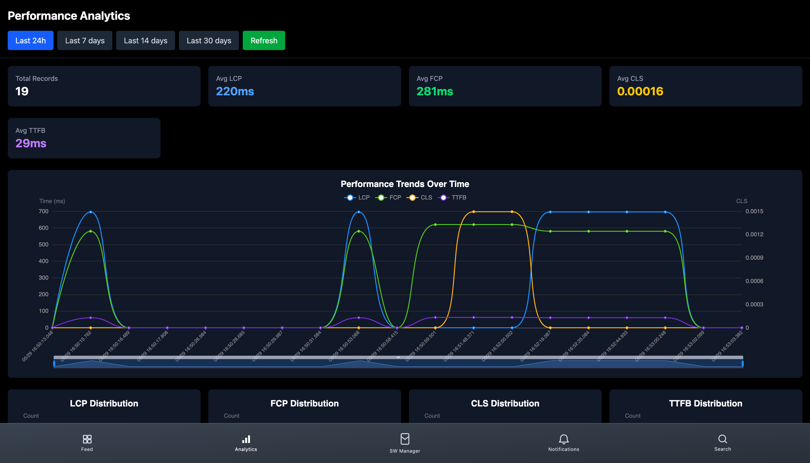

# 🚀 AI-AGENT: AI 驱动的研发效能与前端监控平台

[](LICENSE)
[](https://nodejs.org/)
[](https://docs.docker.com/compose/)

> **💡 项目定位**：一款基于 Monore-Repo 架构构建的 AI 助手，深度融合 **RAG 检索增强生成**、**自动化代码审查**、**PDF 文档智能分析**及 **Core Web Vitals 监控**，旨在通过 AI 赋能提升研发团队效能与系统可观测性。

---

## 🎨 产品预览 (Screenshots)

[//]: # "请在此处替换为你的真实截图。建议找一张 AI 聊天界面的图，一张监控大屏的图，拼接成一张长图。"
[//]: # "如果没有图，这段 Markdown 会显示一个红色的占位符，请务必替换！"

| AI 智能交互中心                                                 | 实时性能监控大屏                                                       |
| :-------------------------------------------------------------- | :--------------------------------------------------------------------- |
|  |  |

---

## 🚀 核心亮点与技术深度

本项目不仅仅是代码的堆砌，更是对 AI 落地场景的深度探索：

### 🤖 RAG 增强与流式对话

- **技术实现**：基于 `LangChain` 对接 `Qwen (DashScope)`，利用 `SSE` 实现流式响应。
- **价值**：集成 **MCP 协议** 构建私有知识库检索，有效解决大模型幻觉问题，让 AI 回答更精准。

### 🔍 智能化代码审查 (Code Review)

- **技术实现**：利用 `GitHub Webhooks` 监听 PR 事件，触发 AI 自动分析流程。
- **价值**：将人工 Code Review 效率提升 50%+，自动捕捉逻辑漏洞与规范问题，降低人工成本。

### 📊 前端性能监控体系

- **技术实现**：自研 SDK 采集 **Core Web Vitals (LCP, FID, CLS)**，数据落盘 `ClickHouse`，通过 `ECharts` 可视化。
- **价值**：毫秒级定位前端渲染瓶颈，为性能优化提供精准数据支撑。

### 📄 文档智能处理 (OCR & PDF)

- **技术实现**：集成 `Tesseract.js` 与 `pdf-lib`，实现图片/PDF 文档的自动化解析。
- **价值**：解决非结构化数据处理难题，支持复杂文档的数字化提取与分析。

### ⚡ 并行任务与异步处理

- **技术实现**：基于 `Worker Threads` 的 CPU 密集型任务并行处理，结合 `RabbitMQ` 实现异步消息队列。
- **价值**：优化高负载场景下的系统吞吐量，避免主线程阻塞。

### 🏗️ 高可用微服务架构

- **技术实现**：采用 `NestJS (Monorepo)` + `React 19` 全栈 TypeScript 方案；引入 `RabbitMQ` 异步解耦，`Docker` 容器化部署。
- **价值**：保证系统在高并发场景下的稳定性与可扩展性，具备生产级交付能力。

---

## 🛠️ 核心技术栈

| 类别         | 技术组件                                       |
| :----------- | :--------------------------------------------- |
| **AI Layer** | LangChain, Qwen (DashScope), MCP Protocol      |
| **Backend**  | NestJS 11, PostgreSQL 16, TypeORM, RabbitMQ    |
| **Frontend** | React 19, Vite, TailwindCSS, ECharts           |
| **DevOps**   | Docker, Docker Compose, pnpm Workspaces, Nginx |

---

## 🚀 快速启动指南

只需简单的几步，即可在本地运行本项目。

### 1. 克隆项目

```bash
git clone <repository-url>
cd ai-agent-monorepo
```

### 2. 安装依赖

```bash
pnpm install
```

### 3. 配置环境变量

```bash
1. github secrets environment 配置你的环境变量
2. 各个项目都有自己的 .env 文件，请自行配置
```

### 4. 启动项目

#### 方式 A：本地开发 (推荐)

```bash
# 终端 1: 启动后端
pnpm start:server

# 终端 2: 启动前端
pnpm start:ui
```

#### 方式 B：Docker 一键启动

```bash
./docker.sh start
```

### 访问地址:

🌐 前端: http://localhost:3001 https://localhost

🔌 后端 API: http://localhost:3000

🐰 RabbitMQ 管理: http://localhost:15672 (guest/guest)

### 📚 详细文档与贡献指南

为了保持主文档的简洁，详细的架构设计、部署脚本和贡献规范请参考下方链接：

[系统架构、数据流与部署策略](./ARCHITECTURE.md)

[容器化部署详细配置](./DOCKER_QUICK_REF.md)

### 目录结构

```bash
ai-agent-monorepo/
├── packages/
│   ├── back-end/           # NestJS 后端服务 (Port 3000)
│   │   ├── src/
│   │   │   ├── ai-qwen/    # AI 聊天核心
│   │   │   ├── analysis/   # 性能分析与埋点
│   │   │   └── micro-service/ # 微服务模块
│   │   └── Dockerfile
│   └── front-end/          # React 前端应用 (Port 3001)
│       ├── app/
│       │   ├── Chat.tsx    # AI 聊天界面
│       │   └── analytics.tsx # 监控看板
│       └── Dockerfile
├── docker-compose.yml      # 生产部署配置
├── docker-compose.dev.yml  # 开发环境配置
└── ARCHITECTURE.md         # 架构设计文档
```

### 监控指标

1. LCP (最大内容绘制): 页面加载性能
2. FID (首次输入延迟): 交互响应速度
3. CLS (累积布局偏移): 视觉稳定性

### 安全策略

1. 环境变量隔离 (Never Commit)
2. CORS 跨域保护
3. DTO 输入验证
4. SQL 注入防护

## 贡献指南

- [NestJS](https://nestjs.com/) - Progressive Node.js framework
- [LangChain](https://js.langchain.com/) - LLM orchestration framework
- [React Router](https://reactrouter.com/) - Declarative routing
- [RabbitMQ](https://www.rabbitmq.com/) - Message broker
- [Web Vitals](https://web.dev/vitals/) - Performance metrics
