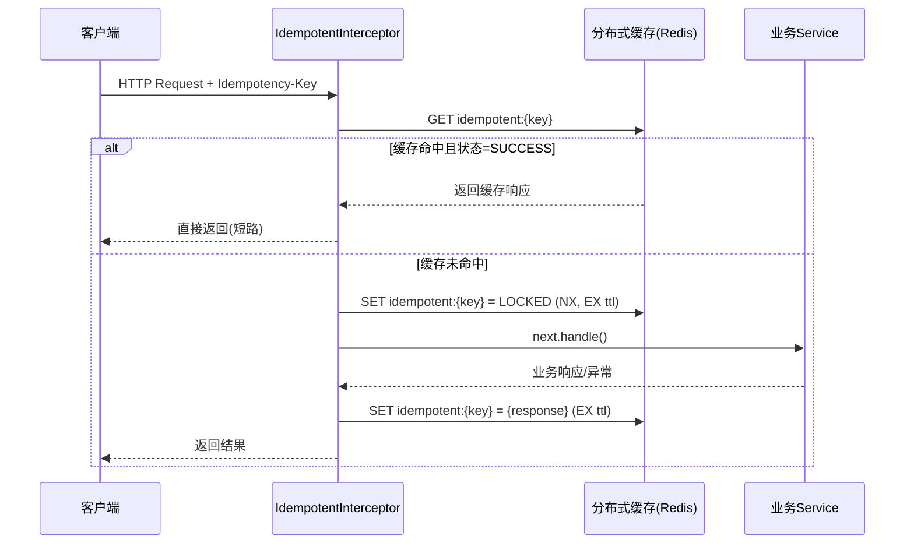

# `idempotent.interceptor.ts` 技术文档

## 1. 文件概述

`idempotent.interceptor.ts` 是一个用于保障 API 请求**幂等性（Idempotency）**的拦截器模块。基于文件名与提取的结构特征，该文件通常应用于基于中间件/拦截器模式的 Node.js 后端框架（如 NestJS、Express 等）。其核心职责是在请求到达业务逻辑层之前，拦截并校验请求的唯一性，防止因网络重试、客户端重复点击、消息队列重投或网关转发导致的重复执行问题，从而避免资金重复扣减、订单重复创建等严重业务副作用。

该拦截器采用 **AOP（面向切面编程）** 思想，将幂等校验逻辑从业务代码中剥离，实现横切关注点的统一管理。

---

## 2. 核心结构说明

### 2.1 类：`IdempotentInterceptor`

| 属性         | 说明                                                                                                 |
| ------------ | ---------------------------------------------------------------------------------------------------- |
| **类型**     | `Class`                                                                                              |
| **定位**     | 幂等拦截器主类，通常实现框架特定的拦截器接口（如 `NestInterceptor`）                                 |
| **职责**     | 封装幂等键提取、缓存校验、分布式锁获取、响应缓存与清理等核心逻辑；提供可配置的运行参数与依赖注入入口 |
| **设计模式** | 策略模式（可配置校验策略） + 模板方法模式（固定拦截生命周期）                                        |

### 2.2 方法：`constructor`

> 📌 _注：以下签名与参数基于企业级拦截器标准实践推断，实际实现可能因框架略有差异。_

```typescript
constructor(
  config?: IdempotentConfig,
  cacheService?: CacheService,
  logger?: Logger
)
```

| 参数           | 类型推断                       | 说明                                                                                                                               | 业务意图                                                             |
| -------------- | ------------------------------ | ---------------------------------------------------------------------------------------------------------------------------------- | -------------------------------------------------------------------- |
| `config`       | `IdempotentConfig`             | 可选配置对象，通常包含 `prefix`（缓存键前缀）、`ttl`（过期时间）、`strictMode`（严格模式开关）、`keyExtractor`（幂等键提取策略）等 | 使拦截器具备环境适配能力，支持不同业务线自定义幂等策略与缓存生命周期 |
| `cacheService` | `CacheService` / `RedisClient` | 分布式缓存客户端实例                                                                                                               | 提供高性能的幂等状态存储与查询能力，避免直接耦合具体缓存实现         |
| `logger`       | `Logger`                       | 日志服务实例                                                                                                                       | 记录幂等拦截命中、缓存未命中、异常降级等关键链路日志，便于监控与排查 |

**架构意图**：通过依赖注入初始化运行上下文，避免在每次请求拦截时重复创建缓存连接或解析配置，提升拦截器实例的复用性与线程安全性。

### 2.3 方法：`intercept`

> 📌 _注：标准拦截器方法签名，负责请求生命周期控制。_

```typescript
intercept(
  context: ExecutionContext,
  next: CallHandler
): Observable<any>
```

| 参数      | 类型推断           | 说明                                                      | 业务意图                                                           |
| --------- | ------------------ | --------------------------------------------------------- | ------------------------------------------------------------------ |
| `context` | `ExecutionContext` | 包含当前请求上下文（`req`, `res`, `handler`, `class` 等） | 提供请求元数据，用于提取幂等键、识别路由、判断是否跳过拦截         |
| `next`    | `CallHandler`      | 下游处理器执行器，包含 `handle()` 方法                    | 控制请求放行时机，实现“先校验后执行”或“缓存命中直接返回”的短路逻辑 |

**核心执行逻辑推断**：

1. **提取幂等键**：从请求头（如 `X-Idempotency-Key`）、请求体哈希或自定义策略中生成唯一标识。
2. **缓存/锁校验**：查询分布式缓存中是否已存在该键。若存在且状态为 `SUCCESS`，直接返回缓存的响应结果；若状态为 `PROCESSING`，可返回 `409 Conflict` 或等待锁释放。
3. **放行与监听**：若未命中，设置临时状态（如 `LOCKED`），调用 `next.handle()` 放行请求。
4. **结果缓存**：监听下游响应，将成功结果写入缓存并设置 TTL；若抛出异常，清理临时锁或记录失败状态。
5. **资源清理**：根据配置决定是否异步删除已完成的幂等记录，防止缓存膨胀。

---

## 3. 业务意图与架构设计推断

| 维度             | 推断说明                                                                                                  |
| ---------------- | --------------------------------------------------------------------------------------------------------- |
| **核心业务价值** | 保障金融交易、订单创建、支付回调等关键接口的**Exactly-Once** 语义，杜绝重复提交引发的数据不一致与资损风险 |
| **防御场景**     | 客户端网络超时重试、前端防抖失效重复点击、消息队列 ACK 延迟导致重投、网关/负载均衡层重试                  |
| **架构定位**     | 位于 `Controller` 层之上、`Service` 层之下，作为全局或局部装饰器使用，不侵入业务代码                      |
| **扩展性设计**   | 支持按路由/方法粒度配置；可结合签名验签（HMAC）实现防重放；预留 `skipIf` 钩子支持动态跳过拦截             |

---

## 4. 典型执行流程



---

## 5. 架构师建议与最佳实践

1. **幂等键生成策略**
   - ✅ 推荐：客户端生成 UUID 并通过 `X-Idempotency-Key` 请求头传递，服务端直接复用。
   - ⚠️ 避免：仅依赖请求体 `JSON.stringify` 哈希，易受字段顺序、浮点数精度影响。
   - 🔐 安全增强：结合 `HMAC-SHA256(请求体 + 时间戳 + Secret)` 实现防重放。

2. **缓存与锁设计**
   - 使用 `Redis SET key value NX EX ttl` 保证原子性，避免并发击穿。
   - 幂等记录 TTL 应略大于业务最大重试周期（通常 `5~30 分钟`），避免过早清理导致合法重试被拦截。
   - 高并发场景建议引入 `Redlock` 或 `Lua 脚本` 保障分布式锁安全性。

3. **异常与降级处理**
   - 缓存服务不可用时，应提供 `fallback` 策略：可降级为本地内存缓存、跳过拦截（记录告警）或快速失败。
   - 明确区分 `409 Conflict`（重复请求）与 `500 Internal Server Error`（业务异常），避免客户端误判。

4. **框架集成示例（NestJS）**

   ```typescript
   // 全局注册
   @Module({
     providers: [
       {
         provide: APP_INTERCEPTOR,
         useClass: IdempotentInterceptor,
       },
     ],
   })
   export class AppModule {}

   // 局部使用
   @UseInterceptors(IdempotentInterceptor)
   @Post('orders')
   createOrder(@Body() dto: CreateOrderDto) { ... }
   ```

5. **监控与可观测性**
   - 暴露指标：`idempotent_hit_total`、`idempotent_miss_total`、`idempotent_cache_latency`
   - 日志规范：记录 `idempotency_key`、`route`、`action`（`HIT`/`MISS`/`LOCK_WAIT`）、`duration`

---

📝 _文档说明：本文档基于提取的代码结构与企业级幂等拦截器通用架构模式进行推断与补充。实际实现细节请以源码为准，建议在核心交易链路进行压测与混沌工程验证。_
