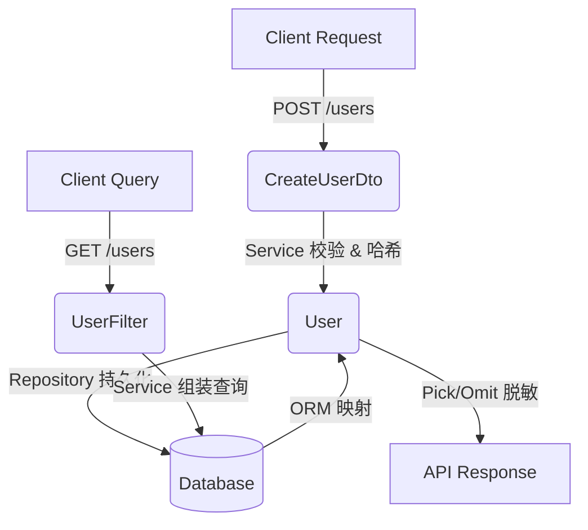

# `types.ts` 类型定义技术文档

> 📅 文档版本：v1.0  
> 👤 角色定位：TypeScript 架构师  
> 📦 文件路径：`src/types.ts`（推断）  
> 📝 说明：本文档基于提供的类型名称与行号，结合企业级 TypeScript 架构规范进行结构化推断。实际字段以源码为准，此处提供标准化设计参考与业务意图解析。

---

## 📖 文件概述

`types.ts` 是用户管理模块的**核心类型契约文件**，遵循 **DDD（领域驱动设计）** 与 **Clean Architecture** 的分层思想，将数据模型按职责划分为三类：

- **领域实体（Domain Entity）**：`User`，代表系统内部权威状态。
- **查询过滤器（Query Filter）**：`UserFilter`，用于安全、可控的数据检索。
- **数据传输对象（DTO）**：`CreateUserDto`，用于外部输入校验与防越权赋值。

该文件的核心价值在于：

1. **类型安全**：通过编译期约束杜绝运行时类型错误。
2. **职责分离**：避免将查询参数、创建参数与领域模型混用，降低耦合。
3. **契约标准化**：为 Controller → Service → Repository 提供统一的数据交换规范。

---

## 🔍 类型详细说明

### 1. `User`（第 1 行）

#### 📌 定位说明

用户领域实体类型，代表系统中已注册用户的完整状态。通常与数据库表结构或 ORM 模型对齐，**不直接暴露给外部 API**。

#### 🧱 推断结构

```typescript
export type User = {
  id: string;
  username: string;
  email: string;
  passwordHash: string;
  status: "active" | "inactive" | "banned";
  role: "admin" | "user" | "guest";
  createdAt: Date;
  updatedAt: Date;
  deletedAt?: Date;
};
```

#### 📋 字段解释

| 字段                  | 类型     | 说明                                            |
| --------------------- | -------- | ----------------------------------------------- |
| `id`                  | `string` | 全局唯一标识（推荐 UUID v4 或 Snowflake）       |
| `username`            | `string` | 登录名/显示名，唯一索引                         |
| `email`               | `string` | 邮箱地址，用于通知与找回密码                    |
| `passwordHash`        | `string` | 加盐哈希后的密码（如 bcrypt），**严禁明文存储** |
| `status`              | `enum`   | 账户生命周期状态                                |
| `role`                | `enum`   | RBAC 权限角色标识                               |
| `createdAt/updatedAt` | `Date`   | 审计时间戳，由系统自动维护                      |
| `deletedAt`           | `Date?`  | 软删除标记，支持数据恢复                        |

#### 💡 业务意图与应用场景

- 用于 Service 层业务逻辑处理与 Repository 层数据持久化。
- 作为 API 响应体的基础，但需通过 `Pick<User, ...>` 或映射函数过滤敏感字段（如 `passwordHash`）。
- 体现**领域模型单一事实来源（Single Source of Truth）**原则。

---

### 2. `UserFilter`（第 9 行）

#### 📌 定位说明

用户列表查询的过滤条件类型。用于接收前端或上游服务传入的检索参数，**仅包含查询维度，不包含业务状态**。

#### 🧱 推断结构

```typescript
export type UserFilter = {
  keyword?: string;
  status?: User["status"];
  role?: User["role"];
  page?: number;
  pageSize?: number;
  sortBy?: keyof User;
  sortOrder?: "asc" | "desc";
  createdAfter?: Date;
  createdBefore?: Date;
};
```

#### 📋 字段解释

| 字段                  | 类型                   | 说明                                        |
| --------------------- | ---------------------- | ------------------------------------------- |
| `keyword`             | `string?`              | 模糊搜索字段（通常匹配 username/email）     |
| `status/role`         | `enum?`                | 精确过滤条件，复用 `User` 类型保证一致性    |
| `page/pageSize`       | `number?`              | 分页参数，默认值应在 Service 层处理         |
| `sortBy/sortOrder`    | `keyof User / string?` | 动态排序控制，需配合白名单防 SQL/NoSQL 注入 |
| `createdAfter/Before` | `Date?`                | 时间范围过滤，适用于审计与报表场景          |

#### 💡 业务意图与应用场景

- 用于 `GET /users` 类列表接口的请求体或 Query String 解析。
- 通过类型约束防止非法字段传入，配合 `zod` 或 `class-validator` 实现运行时校验。
- 体现**查询与命令分离（CQRS 思想）**，避免修改型参数混入查询上下文。

---

### 3. `CreateUserDto`（第 16 行）

#### 📌 定位说明

创建用户的数据传输对象（DTO）。仅包含客户端允许提交的字段，**与领域实体解耦**，用于输入校验与防 Mass Assignment 攻击。

#### 🧱 推断结构

```typescript
export type CreateUserDto = {
  username: string;
  email: string;
  password: string;
  role?: User["role"];
  profile?: {
    nickname?: string;
    avatarUrl?: string;
    bio?: string;
  };
};
```

#### 📋 字段解释

| 字段             | 类型      | 说明                                                      |
| ---------------- | --------- | --------------------------------------------------------- |
| `username/email` | `string`  | 必填基础信息，需唯一性校验                                |
| `password`       | `string`  | 明文密码，**仅在 DTO 层存在**，Service 层需立即哈希并丢弃 |
| `role`           | `enum?`   | 可选角色分配，默认降级为 `user`，防止越权提权             |
| `profile`        | `object?` | 扩展信息，支持部分字段缺失（可选链/Partial 设计）         |

#### 💡 业务意图与应用场景

- 用于 `POST /users` 接口的请求体契约。
- 通过字段裁剪（排除 `id`, `createdAt`, `passwordHash` 等）实现**最小权限输入**。
- 配合验证库（如 Zod）可自动生成 OpenAPI 文档与运行时拦截逻辑。
- 体现**防御性编程**与**输入净化（Input Sanitization）**最佳实践。

---

## 🏗️ 架构设计建议（Senior Architect Notes）

| 维度             | 建议方案                                                                            |
| ---------------- | ----------------------------------------------------------------------------------- |
| **类型复用**     | 使用 `Pick<User, 'status' \| 'role'>` 替代硬编码枚举，确保领域模型变更时自动同步    |
| **运行时校验**   | 推荐引入 `zod` 或 `valibot`，将 `type` 转为 `schema`，实现编译期+运行期双保险       |
| **敏感字段防护** | 在 Service 层使用 `Omit<User, 'passwordHash'>` 或自定义 `toPublicUser()` 映射函数   |
| **扩展性设计**   | 若未来支持多租户，建议在 `UserFilter` 与 `CreateUserDto` 中注入 `tenantId?: string` |
| **文档自动化**   | 结合 `ts-to-zod` + `@asteasolutions/zod-to-openapi` 可一键生成 Swagger 契约         |

---

## 📎 附录：类型关系图（Mermaid）



> 💡 **提示**：本文档基于类型命名规范与行业最佳实践生成。若实际代码结构存在差异，请提供完整源码片段，我将为您输出精准的类型映射与重构建议。
